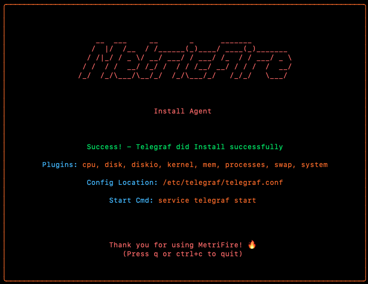

# HostedGraphite CLI

<p align="center">
  
  <h3 align="center">HostedGraphite CLI</h3>
  <p align="center">Monitoring Made Easy.</p>
</p>

---

HostedGraphite CLI is a command-line tool for managing monitoring agents with HostedGraphite. It simplifies the installation, configuration, and management of monitoring agents like Telegraf.

## Features

- Install, update, and uninstall monitoring agents
- Update API keys for agents
- Interactive TUI for managing agents
- Support for multiple operating systems (Linux, Windows, macOS)

## Documentation

Find full documentation at: [HostedGraphite Docs](https://docs.hostedgraphite.com/).

## Get Started

Get started with HostedGraphite today by signing up for a free trial at [HostedGraphite](https://www.hostedgraphite.com/signup).

## Installation

To install the HostedGraphite CLI, you can use the pre-built binaries or build from source.

#### Linux (Debian-based)
```sh
curl -LO https://github.com/hostedgraphite/hg-cli/releases/download/v0.0.1-alpha/hg-cli_0.0.1-alpha_linux_amd64.deb

sudo dpkg -i hg-cli_0.0.1-alpha_linux_amd64.deb
```
#### Linux (RPM-based)
```sh
curl -LO https://github.com/hostedgraphite/hg-cli/releases/download/v0.0.1-alpha/hg-cli_0.0.1-alpha_linux_amd64.rpm

sudo rpm -i hg-cli_0.0.1-alpha_linux_amd64.rpm
```

#### macOs
```sh
brew tap hostedgraphite/hg-cli

brew install hg-cli
``` 

#### Windows (AMD64)
```sh
Invoke-WebRequest -Uri "https://github.com/hostedgraphite/hg-cli/releases/download/v0.0.1-alpha/hg-cli_0.0.1-alpha_windows_arm64.zip" -OutFile "hg-cli.zip"

Expand-Archive -Path "hg-cli.zip" -DestinationPath "C:\hg-cli"
```


#### Windows (ARM64)
```sh
Invoke-WebRequest -Uri "https://github.com/hostedgraphite/hg-cli/releases/download/v0.0.1-alpha/hg-cli_0.0.1-alpha_windows_arm64.zip" -OutFile "hg-cli.zip"

Expand-Archive -Path "hg-cli.zip" -DestinationPath "C:\hg-cli"
```

## Usage

hg-cli provides several commands for manager agents:
- install
- update-apikey
- uninstall
- tui

#### Example
To install the Telegraf agent with the default plugins run:
```sh
hg-cli agent install telegraf --apikey YOUR_API_KEY --install default
```
The 'custom' flag can also be passed instead of default, but plugins must also be passed as well.
```sh
hg-cli agent install telegraf --apikey YOUR_API_KEY --install custom --plugins cpu, disk,...
```

## Terminal User Interface
This feature can be enabled with the command:
```sh
hg-cli tui
```
Currently serves the same function as the CLI with a bit of flashiness. But more features will be releases which will utilize this feature to it's full potential, so stay tuned.


## License
This project is licensed under the Apache License 2.0.
See the LICENSE file for details.

